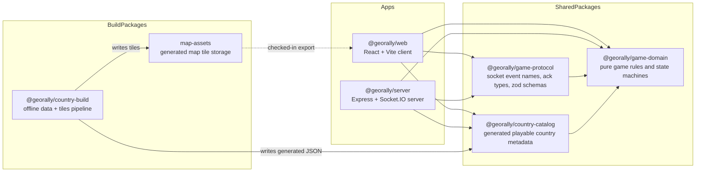

# GeoRally

GeoRally is an interactive educational geography game. A player sees a country prompt, finds it on a real map, gets immediate feedback, and repeats short rounds until the country, flag, capital, currency, and region stick. It's built as an npm-workspaces monorepo with a React client, an Express + Socket.IO realtime server, and a set of framework-free shared packages that hold the actual game rules.

> **Status:** actively developed, heading toward classroom use.

## Table of contents

- [Features](#features)
- [Tech stack](#tech-stack)
- [Monorepo layout](#monorepo-layout)
- [Getting started](#getting-started)
- [Architecture](#architecture)
- [Scripts](#scripts)
- [Contributing](#contributing)
- [License](#license)

## Features

- **Singleplayer world-map training** — fully client-side, no server needed. Pick question count, difficulty, and region, then click countries on an interactive map. Each round tracks attempts (`Hearts`), a `QuestionTimer`, and shows a result modal; a wrong guess costs an attempt, and running out (or giving up) reveals the answer.
- **Realtime multiplayer rooms** — a host creates a room and shares a short code or link; players join from their own devices and everyone answers the same timed round.
- **Reconnect support** — host and player sessions persist a `memberSessionToken` in `localStorage`, so a refresh or dropped connection doesn't kick you out of a room.
- **Typed realtime protocol** — every socket event is schema-validated with `zod` and every response is an explicit `{ ok, data }` / `{ ok: false, error }` ack; the server never sends raw internal room state, only role-specific projected views.
- **Self-built map data** — the playable country catalog and vector map tiles are generated offline from open data sources (Natural Earth, MapLibre demotiles, REST Countries, Wikidata) rather than pulled from a paid map provider at runtime.

## Tech stack

| Layer                   | Technology                                                                                       |
| ----------------------- | ------------------------------------------------------------------------------------------------ |
| Web client              | React 18, Vite 7, TypeScript, Tailwind CSS 4, MapLibre GL + `react-map-gl`, `react-router-dom` 7 |
| Realtime client         | `socket.io-client`                                                                               |
| UI extras               | `motion` (animation), `lucide-react` (icons)                                                     |
| Realtime server         | Node.js, Express 5, Socket.IO 4, `tsx` (dev runner)                                              |
| Validation / contracts  | Zod                                                                                              |
| Game rules              | Hand-written TypeScript state machines (no game engine/framework)                                |
| Monorepo tooling        | npm workspaces                                                                                   |
| Map/data build pipeline | Natural Earth, MapLibre demotiles, REST Countries, Wikidata, Tippecanoe/tile-join                |

## Monorepo layout

```text
georally-game/
├── apps/
│   ├── web/       # React + Vite client (singleplayer + multiplayer UI)
│   └── server/    # Express + Socket.IO realtime server (multiplayer only)
├── packages/
│   ├── game-domain/       # pure game rules & state machines, no framework deps
│   ├── game-protocol/     # socket event names, ack types, zod schemas
│   ├── country-catalog/   # generated playable-country metadata
│   ├── country-build/     # offline pipeline that produces the catalog + map tiles
│   └── map-assets/        # generated map tiles land here (dist/ is gitignored)
└── package.json
```

The full annotated source tree lives in [`docs/architecture/source-tree.md`](docs/architecture/source-tree.md).

## Getting started

**Prerequisites:** Node.js (LTS) and npm 7+ (for workspaces support).

```bash
git clone https://github.com/atamuratov07/georally-game.git
cd georally-game
npm install
```

**Run the web client** (singleplayer works with this alone, no server needed — Vite serves at `http://localhost:5173` by default):

```bash
npm run dev:web
```

**Run the realtime server** (only needed for multiplayer — listens on `0.0.0.0:3001` by default):

```bash
npm run dev:server
```

**Server configuration** (`apps/server/src/config/env.ts`, parsed with `zod`):

| Variable                  | Default                                                                            |
| ------------------------- | ---------------------------------------------------------------------------------- |
| `PORT`                    | `3001`                                                                             |
| `HOST`                    | `0.0.0.0`                                                                          |
| `CORS_ORIGIN`             | `http://localhost:5174` (comma-separated list; adjust to match your Vite dev port) |
| `REVEAL_DURATION_MS`      | `3000`                                                                             |
| `LEADERBOARD_DURATION_MS` | `3000`                                                                             |

**Web configuration:** `VITE_GAME_SERVER_ORIGIN` optionally points the client at a separate server origin; if unset, the Socket.IO client connects to the same origin at `/game`.

**Regenerating map data** (only needed if you're changing the country catalog or tiles, not for normal development):

```bash
npm run build:data                  # country-build's data step
npm run build:country-registry      # write packages/country-catalog/generated/*
npm run build:map-assets            # write tiles into packages/map-assets/dist/public/map/tiles
```

## Architecture

GeoRally's architecture is documented in depth under [`docs/architecture/`](docs/architecture/README.md), so this README stays skimmable. The short version:



| Doc                                                                        | Covers                                                                           |
| -------------------------------------------------------------------------- | -------------------------------------------------------------------------------- |
| [`README.md`](README.md)                                                   | Project description, workspace dependency graph, runtime architecture, route map |
| [`docs/architecture/source-tree.md`](docs/architecture/source-tree.md)     | Full annotated source tree                                                       |
| [`docs/architecture/singleplayer.md`](docs/architecture/singleplayer.md)   | Local game flow and state machine                                                |
| [`docs/architecture/multiplayer.md`](docs/architecture/multiplayer.md)     | Client/server realtime flow, room + game state model, protocol, view projection  |
| [`docs/architecture/data-pipeline.md`](docs/architecture/data-pipeline.md) | Offline build pipeline for the country catalog and map tiles                     |
| [`docs/architecture/persistence.md`](docs/architecture/persistence.md)     | What's persisted, where, and what that implies for scaling                       |

## Scripts

All run from the repo root:

| Script                           | What it does                                                                                             |
| -------------------------------- | -------------------------------------------------------------------------------------------------------- |
| `npm run dev:web`                | Vite dev server for `@georally/web`                                                                      |
| `npm run build:web`              | Production build of the web client (`tsc -b && vite build`)                                              |
| `npm run preview:web`            | Preview the production build of `@georally/web`                                                          |
| `npm run dev:server`             | Dev mode for the `@georally/server` Socket.IO server (`tsx watch`)                                       |
| `npm run build:server`           | Type-check the server (`tsc --noEmit`)                                                                   |
| `npm run build:data`             | Runs `@georally/country-build`'s data build step                                                         |
| `npm run build:country-registry` | Generates `packages/country-catalog/generated/*`                                                         |
| `npm run build:map-assets`       | Generates tiles into `packages/map-assets/dist/public/map/tiles`, served at `/map/tiles/{z}/{x}/{y}.pbf` |
| `npm run lint`                   | ESLint across the repo                                                                                   |

There's no root-level `test` script yet.
