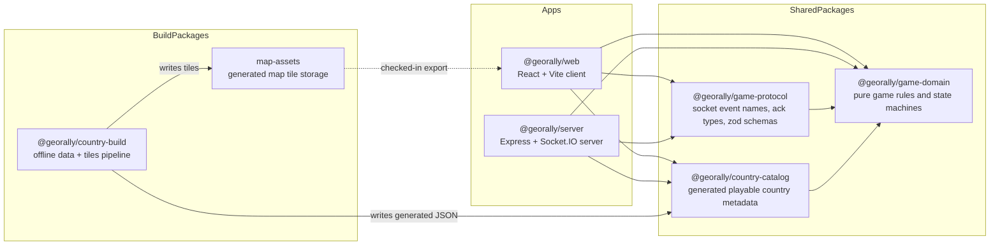

# GeoRally

GeoRally is a real-time geography quiz game: a player sees a country prompt, finds it on a real map, gets immediate feedback, and repeats short rounds until the country, flag, capital, currency, and region stick. It supports solo practice and live multiplayer rooms — including a classroom mode built for a teacher running a session with a class — in English, Russian, and Uzbek (Latin script). It's a pnpm workspaces monorepo with a React client, an Express + Socket.IO realtime server, and a set of framework-free shared packages that hold the actual game rules.

> **Status:** live in production at [georally.world](https://georally.world), actively developed.

## Table of contents

- [Features](#features)
- [Tech stack](#tech-stack)
- [Monorepo layout](#monorepo-layout)
- [Getting started](#getting-started)
- [Configuration](#configuration)
- [Internationalization](#internationalization)
- [Analytics](#analytics)
- [Testing](#testing)
- [Deployment](#deployment)
- [Architecture](#architecture)
- [Scripts](#scripts)
- [Contributing](#contributing)
- [License](#license)

## Features

- **Singleplayer world-map training** — fully client-side, no server needed. Pick question count, difficulty, region, and attempts-per-question, then click countries on an interactive map. Each round tracks attempts (`Hearts`) and a `QuestionTimer`; a wrong guess costs an attempt, and running out (or giving up) reveals the answer.
- **Two distinct multiplayer modes** — **Group**, where the host also competes and the game is self-driving (rounds auto-advance on a timer, ~3s reveal/leaderboard windows), and **Classroom**, where the host is a monitor only (doesn't occupy a player slot, doesn't compete) and controls pacing manually, round by round.
- **Realtime multiplayer rooms** — a host creates a room and shares a short code or link; players join from their own devices and everyone answers the same round. The server pushes full, role-specific room snapshots on every state change rather than granular deltas, which keeps client state simple to reason about.
- **Reconnect support with mode-aware amnesty** — host and player sessions persist a `memberSessionToken` in `localStorage`, so a refresh or dropped connection doesn't kick you out of a room. How long a room tolerates a disconnected host differs by mode (shorter for classroom, since the teacher is the pacing authority) and is configurable server-side.
- **Multi-language UI** — English, Russian, and Uzbek (Latin script), with locale-prefixed routes (`/en`, `/ru`, `/uz`) and automatic language detection/redirect for unprefixed URLs.
- **Typed realtime protocol** — every socket event is schema-validated with `zod` and every response is an explicit `{ ok, data }` / `{ ok: false, error }` ack; the server never sends raw internal room state, only role-specific projected views.
- **Self-built map data** — the playable country catalog and vector map tiles are generated offline from open data sources (Natural Earth, MapLibre demotiles, REST Countries, Wikidata) rather than pulled from a paid map provider at runtime.
- **Product analytics** — GA4 event tracking across both singleplayer and multiplayer, covering visits, game starts/completions, per-question outcomes, room size, and room mode, without relying on GA4's automatic page-view tracking alone (see [Analytics](#analytics)).
- **Automated server tests** — unit tests for the room service and HTTP integration tests, run with Vitest.

## Tech stack

| Layer                   | Technology                                                                                                   |
| ----------------------- | ------------------------------------------------------------------------------------------------------------ |
| Web client              | React 18, Vite 7, TypeScript, Tailwind CSS 4, MapLibre GL + `react-map-gl`, `react-router-dom` 7             |
| Internationalization    | `i18next`, `react-i18next`, `i18next-browser-languagedetector`                                               |
| Realtime client         | `socket.io-client`                                                                                           |
| UI extras               | `motion` (animation), `lucide-react` (icons), Fontsource variable Rubik                                      |
| Realtime server         | Node.js, Express 5, Socket.IO 4, `tsx` (dev runner), `tsup` (build)                                          |
| Validation / contracts  | Zod                                                                                                          |
| Testing                 | Vitest, Supertest (server unit + HTTP integration tests)                                                     |
| Game rules              | Hand-written TypeScript state machines (no game engine/framework)                                            |
| Monorepo tooling        | pnpm workspaces                                                                                              |
| Map/data build pipeline | Natural Earth, MapLibre demotiles, REST Countries, Wikidata (SPARQL/WDQS), Tippecanoe/tile-join (Dockerized) |
| Analytics               | Google Analytics 4 (`gtag.js`, custom event tracking)                                                        |
| Deployment              | Docker Compose (server + nginx + certbot), Let's Encrypt                                                     |

## Monorepo layout

```text
georally-game/
├── apps/
│   ├── web/       # React + Vite client — singleplayer + multiplayer UI, built as one Vite entry per locale
│   └── server/    # Express + Socket.IO realtime server (multiplayer only)
├── packages/
│   ├── game-domain/       # pure game rules & state machines, no framework deps
│   ├── game-protocol/     # socket event names, ack types, zod schemas
│   ├── country-catalog/   # generated playable-country metadata
│   ├── country-build/     # offline pipeline that produces the catalog + map tiles
│   └── map-assets/        # generated map tiles land here (dist/ is gitignored)
├── docs/architecture/     # deep-dive docs — see Architecture below
├── docker-compose.yaml    # server + nginx + certbot, used for the production deploy
└── pnpm-workspace.yaml
```

The full annotated source tree lives in [`docs/architecture/source-tree.md`](docs/architecture/source-tree.md).

## Getting started

**Prerequisites:** Node.js (LTS) and pnpm (the repo pins `pnpm@11.21.0` via `packageManager` — `corepack enable` will pick that up automatically).

```bash
git clone https://github.com/atamuratov07/georally-game.git
cd georally-game
pnpm install
```

**Run the web client** (singleplayer works with this alone, no server needed — Vite serves at `http://localhost:5173` by default):

```bash
pnpm dev:web
```

**Run the realtime server** (only needed for multiplayer — listens on `0.0.0.0:3001` by default):

```bash
pnpm dev:server
```

**Web configuration:** `VITE_GAME_SERVER_ORIGIN` optionally points the client at a separate server origin; if unset, the Socket.IO client connects to the same origin at `/game`.

**Regenerating map data** (only needed if you're changing the country catalog or tiles, not for normal development):

```bash
pnpm build:data                  # country-build's data step
pnpm build:country-registry      # write packages/country-catalog/generated/*
pnpm build:map-assets            # write tiles into packages/map-assets/dist/tiles
```

## Configuration

Server configuration (`apps/server/src/config/env.ts`, parsed with `zod`):

| Variable                                  | Default                 | Notes                                                                                               |
| ----------------------------------------- | ----------------------- | --------------------------------------------------------------------------------------------------- |
| `PORT`                                    | `3001`                  |                                                                                                     |
| `HOST`                                    | `0.0.0.0`               |                                                                                                     |
| `CORS_ORIGIN`                             | `http://localhost:5173` | Comma-separated list; production sets this to `https://georally.world`                              |
| `REVEAL_DURATION_MS`                      | `3000`                  | Group mode auto-advance timing                                                                      |
| `LEADERBOARD_DURATION_MS`                 | `3000`                  | Group mode auto-advance timing                                                                      |
| `ROOM_CAPACITY_LIMIT`                     | `40`                    | Max connected members per room                                                                      |
| `ROOM_NO_CONNECTED_MEMBERS_TTL`           | `600000` (10 min)       | How long an empty room is kept alive                                                                |
| `ROOM_HOST_DISCONNECTED_IN_GROUP_TTL`     | `300000` (5 min)        | Amnesty window for a disconnected host, group mode                                                  |
| `ROOM_HOST_DISCONNECTED_IN_CLASSROOM_TTL` | `180000` (3 min)        | Amnesty window for a disconnected host, classroom mode (shorter — the host is the pacing authority) |
| `ROOM_FINISHED_TTL`                       | `900000` (15 min)       | How long a finished room's result stays viewable                                                    |

## Internationalization

The client is built as one Vite entry per locale (`index.html`, `locales/en.html`, `locales/ru.html`, `locales/uz.html`), each bootstrapping the same app. Routes are locale-prefixed (`/en/...`, `/ru/...`, `/uz/...`); a client-side gate (`LocaleGate`) detects the browser's language and redirects unprefixed URLs to the right one. Supported locales: `en`, `ru`, `uz-Latn` (the last served under the `/uz` URL segment).

## Analytics

Game and site usage is tracked via GA4 (`gtag.js`), loaded from each locale's HTML entry. Custom events are prefixed `sp_` for singleplayer and `mp_` for multiplayer where the same concept exists in both modes; room-lifecycle events that have no singleplayer equivalent are unprefixed. Tracking helpers live in `apps/web/src/shared/analytics/`.

| Event                                                    | Fires when                                                                            |
| -------------------------------------------------------- | ------------------------------------------------------------------------------------- |
| `room_created` / `room_joined` / `room_closed`           | A multiplayer room is created, joined, or closed (with the reason and phase at close) |
| `mp_game_start`                                          | The host successfully starts a multiplayer game                                       |
| `game_entered`                                           | A viewer's own room snapshot shows the game as active (per connected client)          |
| `mp_question_answered`                                   | A multiplayer round resolves for the viewer                                           |
| `mp_game_end`                                            | A multiplayer game finishes                                                           |
| `sp_game_start` / `sp_question_answered` / `sp_game_end` | Equivalent lifecycle points in a singleplayer run                                     |

## Testing

Automated tests currently live in `apps/server` only — `game-domain`, `game-protocol`, and the web app don't have their own suites yet.

```bash
pnpm -F @georally/server test             # everything (unit + integration)
pnpm -F @georally/server test:unit        # apps/server/src
pnpm -F @georally/server test:integration # apps/server/tests/integration
pnpm -F @georally/server test:coverage
```

There's no root-level `pnpm test` proxy yet — run via the filtered command above, or `cd apps/server && pnpm test`.

## Deployment

Production runs via Docker Compose: a `server` container (the Socket.IO backend), an `nginx` container (built from `apps/web`, serves the static client and reverse-proxies `/game` to the server), and a `certbot` container that renews the Let's Encrypt TLS certificate on a loop. See `docker-compose.yaml` and `apps/web/Dockerfile` / `apps/server/Dockerfile`.

```bash
docker compose up -d --build
```

## Architecture

GeoRally's architecture is documented in depth under [`docs/architecture/`](docs/architecture), so this README stays skimmable. The short version:



| Doc                                                                        | Covers                                                                          |
| -------------------------------------------------------------------------- | ------------------------------------------------------------------------------- |
| [`docs/architecture/source-tree.md`](docs/architecture/source-tree.md)     | Full annotated source tree                                                      |
| [`docs/architecture/singleplayer.md`](docs/architecture/singleplayer.md)   | Local game flow and state machine                                               |
| [`docs/architecture/multiplayer.md`](docs/architecture/multiplayer.md)     | Client/server realtime flow, room + game state model, protocol, view projection |
| [`docs/architecture/data-pipeline.md`](docs/architecture/data-pipeline.md) | Offline build pipeline for the country catalog and map tiles                    |
| [`docs/architecture/persistence.md`](docs/architecture/persistence.md)     | What's persisted, where, and what that implies for scaling                      |

## Scripts

All run from the repo root:

| Script                        | What it does                                                                                  |
| ----------------------------- | --------------------------------------------------------------------------------------------- |
| `pnpm build`                  | Builds every workspace package (`pnpm -r build`)                                              |
| `pnpm check`                  | Type-checks every workspace package (`pnpm -r check`)                                         |
| `pnpm dev:web`                | Vite dev server for `@georally/web`                                                           |
| `pnpm build:web`              | Production build of the web client (`tsc -b && vite build`)                                   |
| `pnpm preview:web`            | Preview the production build of `@georally/web`                                               |
| `pnpm dev:server`             | Dev mode for the `@georally/server` Socket.IO server (`tsx watch`)                            |
| `pnpm build:server`           | Builds the server (`tsup`)                                                                    |
| `pnpm build:game-domain`      | Builds `@georally/game-domain`                                                                |
| `pnpm build:tippecanoe-image` | Builds the Dockerized `tippecanoe` image used by the map-tile pipeline                        |
| `pnpm build:data`             | Runs `@georally/country-build`'s data build step                                              |
| `pnpm build:country-registry` | Generates `packages/country-catalog/generated/*`                                              |
| `pnpm build:map-assets`       | Generates tiles into `packages/map-assets/dist/tiles`, served at `/map/tiles/{z}/{x}/{y}.pbf` |
| `pnpm lint`                   | ESLint across the repo                                                                        |

Server tests are run separately — see [Testing](#testing).

## Contributing

Open an issue or PR. Run `pnpm lint`, `pnpm check`, and (for server changes) `pnpm -F @georally/server test` before submitting. The codebase is consistently tabs-indented with no semicolons — match the existing style rather than reformatting.
