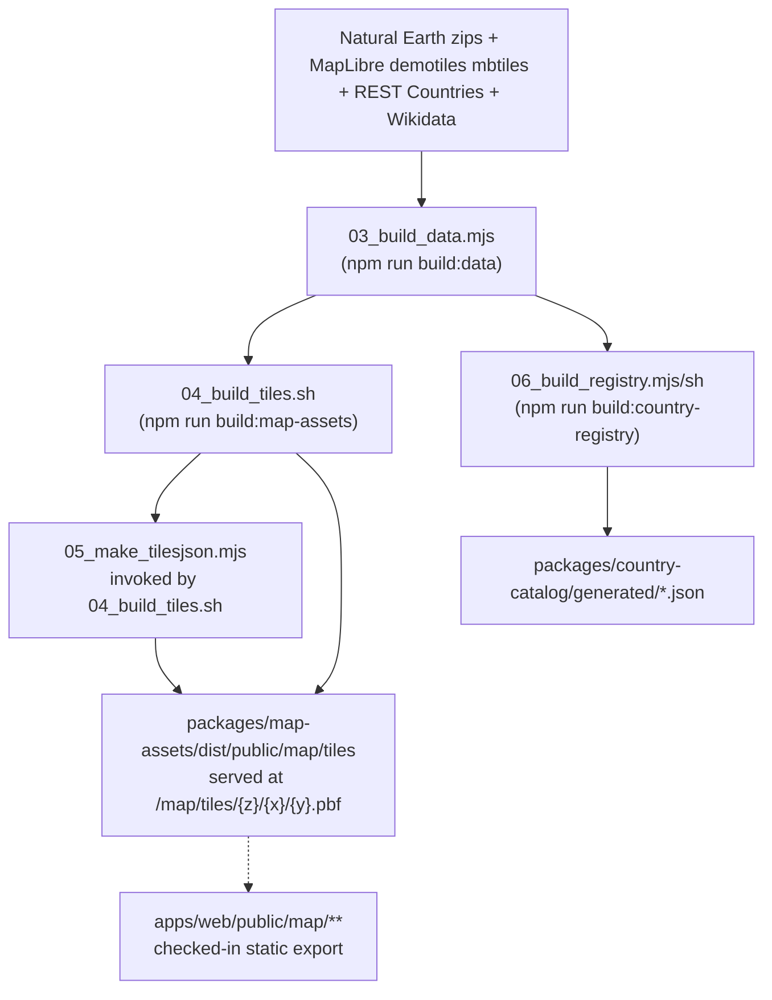

# Data & asset pipeline

`@maptap/country-build` is an offline preparation package. It is not part of the normal web/server runtime, but it explains where the local country catalog and map files come from. It's invoked through root-level scripts: `npm run build:data`, `npm run build:country-registry`, `npm run build:map-assets`, and `npm run backfill:country-uz-latn`.

`04_build_tiles.sh` runs the full tile pipeline (patching, filtering, and merging `.mbtiles` layers with the bundled `tippecanoe`/`tile-join` binaries) and, as its final step, invokes `05_make_tilesjson.mjs` itself — so one root script (`build:map-assets`) produces both the `.pbf` tiles and `tiles.json`.

## Build outputs

- `countries.registry.json` — the full generated country registry.
- `countries.playable.json` — the filtered playable subset used by the app; Uzbek Latin-script names are backfilled into this by `npm run backfill:country-uz-latn`.
- `packages/map-assets/dist/public/map/tiles` — the generated vector tiles and `tiles.json`, written by `npm run build:map-assets`, which passes `--tiles-dir` and `--tiles-url-template /map/tiles/{z}/{x}/{y}.pbf` down to `country-build`. This `dist/` directory is gitignored — it's a build artifact, not checked into the repo.
- `apps/web/public/map/**` — a static export (style.json, vector tiles, glyph PBFs) that _is_ checked into the repo and served directly by the web app.

## Invocation

| Root script                      | Wraps                                                                                   | Produces                                              |
| -------------------------------- | --------------------------------------------------------------------------------------- | ----------------------------------------------------- |
| `npm run build:data`             | `@maptap/country-build`'s `build:data` script (`node scripts/03_build_data.mjs`)        | intermediate data used by the tile and registry steps |
| `npm run build:country-registry` | `@maptap/country-build`'s `build:registry` script (`bash scripts/06_build_registry.sh`) | `packages/country-catalog/generated/*.json`           |
| `npm run build:map-assets`       | `@maptap/country-build`'s `build:tiles` script (`bash scripts/04_build_tiles.sh`)       | `packages/map-assets/dist/public/map/tiles/**`        |
