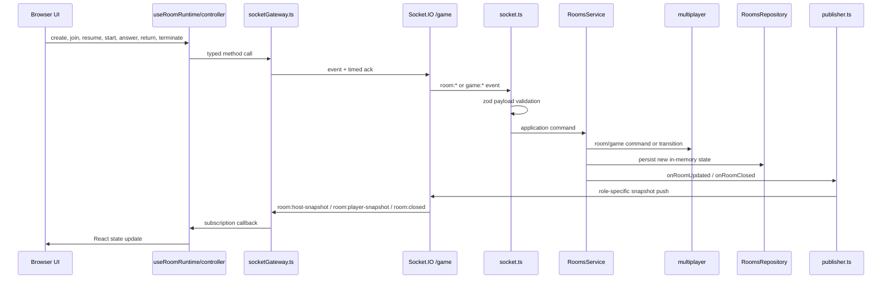
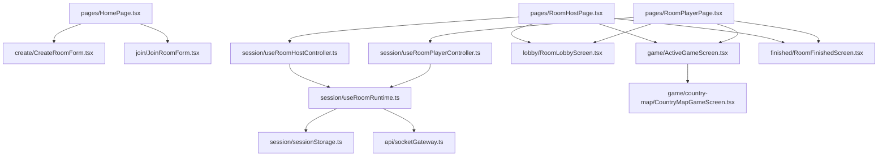
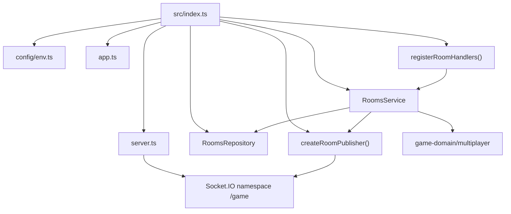
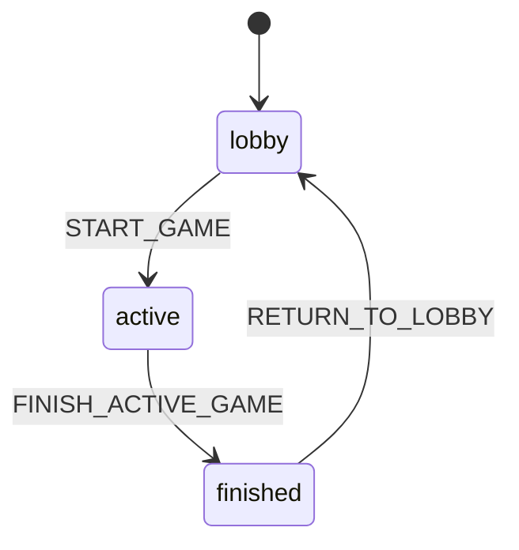
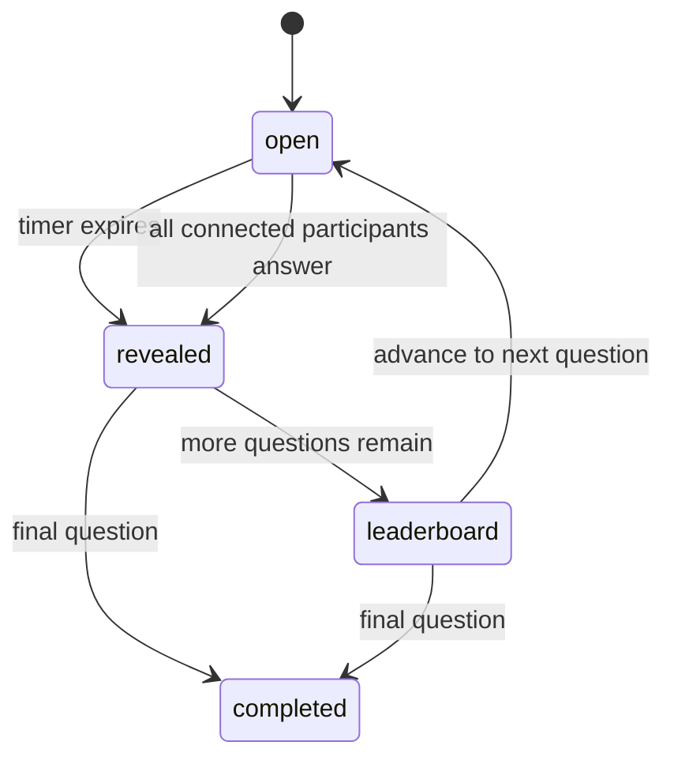
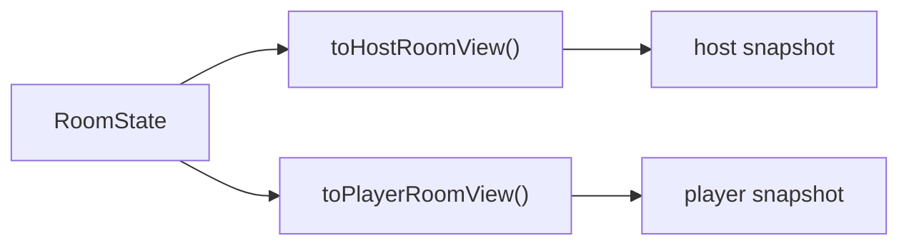

# Multiplayer

The active multiplayer implementation uses `packages/game-domain/src/multiplayer`. An older `packages/game-domain/src/multiplayer` tree still exists in the package, but the server only imports the `multiplayer` room/game model.

Multiplayer is split into four layers:

1. Browser pages, room controllers, and game screens.
2. `socketGateway.ts`, the typed transport boundary.
3. Server socket handlers, `RoomsService`, `RoomsRepository`, and publisher.
4. Shared domain/protocol packages.

- [End-to-end sequence](#end-to-end-sequence)
- [Client split](#client-split)
- [Server room subsystem](#server-room-subsystem)
- [Room and game state model](#room-and-game-state-model)
- [Protocol boundary](#protocol-boundary)
- [View projection model](#view-projection-model)
- [Important behavior notes](#important-behavior-notes)

## End-to-end sequence



## Client split



**Important client behavior:**

- Host and player room sessions are persisted in `localStorage`.
- The saved session contains the room code, member ID, role, and `memberSessionToken`.
- Reconnect/resume uses `memberSessionToken`, not `socket.id`.
- `useRoomRuntime` centralizes connection status: connecting, ready, reconnecting, closed, and error.
- The host can start a game, return a finished room to the lobby, or terminate the room.
- Players can join from a code or link and can resume when a valid saved session exists.

## Server room subsystem



**Server responsibilities:**

- `socket.ts` — validates payloads with zod, checks socket authentication, delegates to `RoomsService`, and returns typed ack responses.
- `service.ts` — creates, joins, resumes, starts games, submits answers, returns finished rooms to lobby, closes rooms, handles disconnects, and schedules timed transitions.
- `repository.ts` — stores rooms by ID/code, member sessions by token, socket-session bindings, and scheduled transition handles.
- `publisher.ts` — converts internal room state into host/player views and emits only the appropriate snapshot type.
- `server.ts` — creates the Socket.IO `/game` namespace with typed event maps and connection state recovery.

## Room and game state model

`multiplayer` separates room state from active game state.

**Room phases:**



**Game phases inside an active room:**



The room stores membership, host identity, connection state, and game history. The active game stores the chosen game kind, generated questions, participant scores, round deadlines, submissions, reveal state, and final leaderboard.

## Protocol boundary

`@maptap/game-protocol` is the typed contract between browser and server. Runtime payload validation is done with zod request schemas in `requests.ts`, while event names and typed callbacks live in `events.ts`.

**Client → server events:**

- `room:create`
- `room:lookup`
- `room:join`
- `room:host-resume`
- `room:player-resume`
- `room:return-to-lobby`
- `room:terminate`
- `game:start`
- `game:submit-answer`

**Server → client push events:**

- `room:host-snapshot`
- `room:player-snapshot`
- `room:closed`

**Ack shape** — every request-response socket event uses:

```ts
type Ack<T> = { ok: true; data: T } | { ok: false; error: RoomProtocolError }
```

The transport contract is: validate request payloads at the server edge, return typed success payloads, return typed protocol/domain errors instead of throwing exceptions across the wire, and push room updates as role-specific snapshots rather than raw internal state.

## View projection model

The server never sends raw `RoomState` to browsers. It projects one internal room into a view for a specific member.



Host views can include all evaluated submissions after reveal or leaderboard. Player views focus on the viewer's own submission and only show leaderboard data once the game phase allows it.

## Important behavior notes

- Host and player sessions are persisted in browser `localStorage`.
- Reconnect/resume uses `memberSessionToken`, not `socket.id`.
- Server state is in memory only — a server restart invalidates all live room state.
- On shutdown, the service emits `room:closed` with reason `server_shutdown` before closing Socket.IO.
- Host and player receive different projections of the same room state via `visibility.ts`.

See [`persistence.md`](persistence.md) for what that in-memory-only design implies for scaling.
