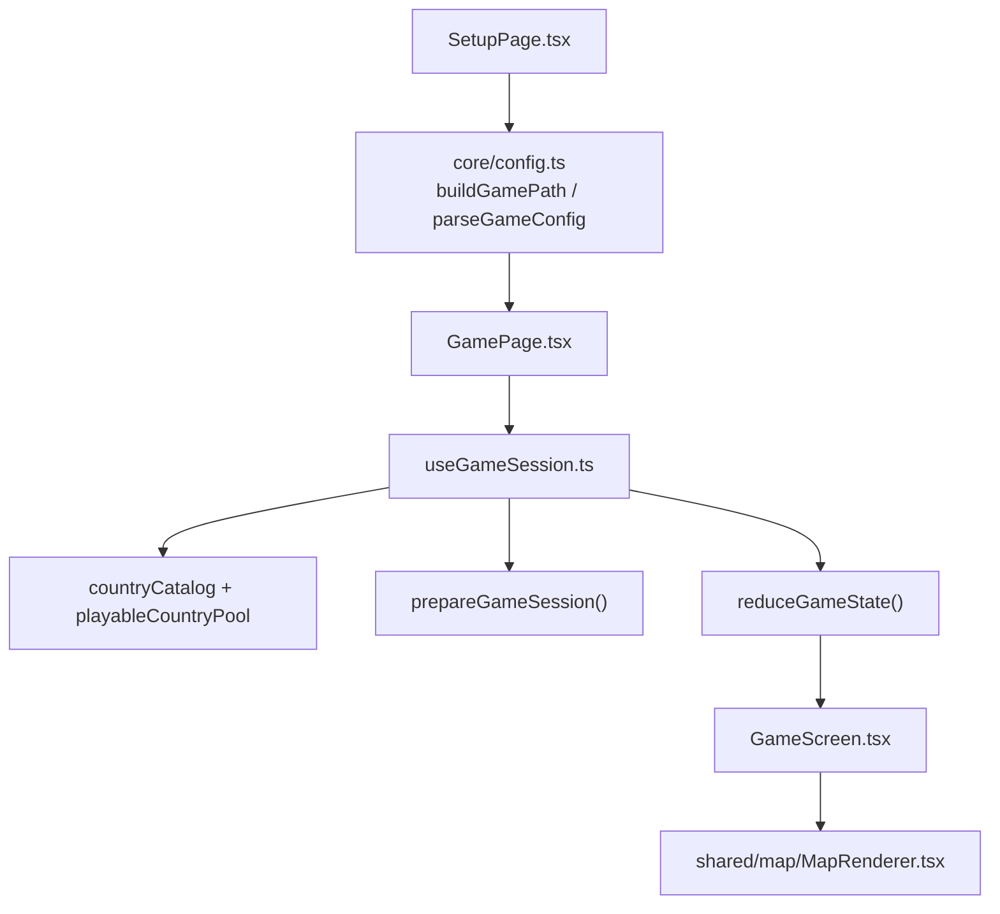
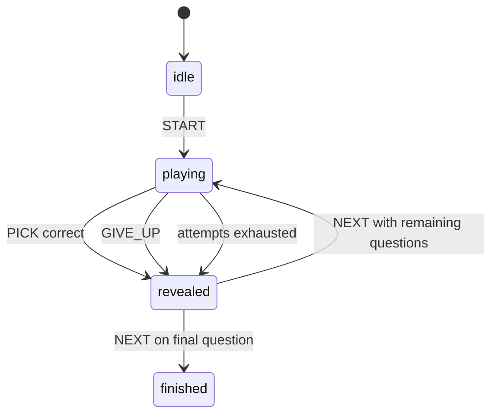

# Singleplayer

Singleplayer is fully local in the browser. It does not connect to the server.

## Flow

## State machine

The state machine lives in `packages/game-domain/src/singleplayer/engine.ts`. Each question allows a configurable number of attempts (`attemptsPerQuestion`); a wrong pick is tracked, and the question reveals once attempts run out, the player gives up, or they pick correctly.

## File responsibilities

- `singleplayer-game/core/config.ts` — serializes and validates the game config in the `/singleplayer/play` URL query string. This is what makes a singleplayer setup shareable/bookmarkable as a link.
- `singleplayer-game/core/useGameSession.ts` — loads local catalog data, prepares the session, and dispatches domain actions.
- `singleplayer-game/components/Hearts.tsx` — renders remaining attempts for the current question.
- `singleplayer-game/components/QuestionTimer.tsx` — the per-question timer UI.
- `singleplayer-game/components/GameResultModal.tsx` — end-of-game summary.
- `packages/game-domain/src/singleplayer/session.ts` — chooses eligible country questions from the country pool.
- `packages/game-domain/src/singleplayer/engine.ts` — applies `START`, `PICK`, `GIVE_UP`, and `NEXT`.
- `packages/game-domain/src/singleplayer/score.ts` — scores a correct answer from response time and wrong attempts.
- `shared/map/MapRenderer.tsx` — the shared interactive map surface, used by both local and multiplayer map gameplay.

See [`README.md`](README.md) for how this fits into the wider app.
