# MapTap Project Architecture Guide

This document is a first-pass project map for new contributors. It explains what each workspace does, how data moves through the system, which files matter most, and what order to read the code in.

## 1. Repo summary

MapTap is an npm-workspaces monorepo with:

- a React + Vite web app
- an Express + Socket.IO realtime server
- a shared pure TypeScript domain layer
- a shared socket protocol package
- a generated local country catalog
- an offline build pipeline that produces the country catalog and map tiles

The project has two gameplay modes:

- singleplayer: fully local in the browser, no server required
- multiplayer: browser UI + Socket.IO server + in-memory room/session state

## 2. Workspace dependency diagram

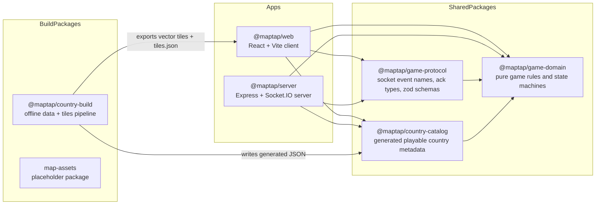

## 3. Runtime architecture in one diagram

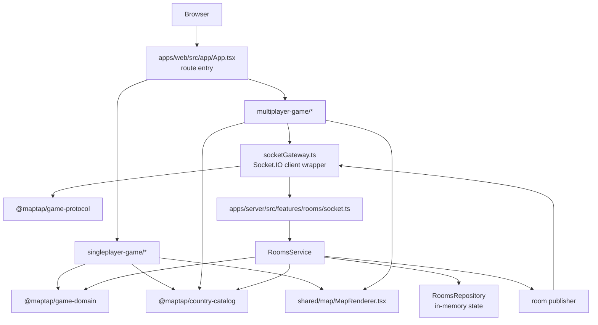

## 4. Source tree map

This is the important code tree, excluding large checked-in map assets under `apps/web/public/map/**`.

```text
maptap/
|-- apps/
|   |-- server/
|   |   |-- package.json
|   |   `-- src/
|   |       |-- index.ts                # server composition root
|   |       |-- app.ts                  # Express app and /health route
|   |       |-- server.ts               # HTTP + Socket.IO server setup
|   |       |-- config/
|   |       |   `-- env.ts              # zod env parsing
|   |       `-- features/
|   |           `-- rooms/
|   |               |-- ids.ts          # room/player/token/id generation
|   |               |-- publisher.ts    # pushes host/player snapshots and room-closed events
|   |               |-- repository.ts   # in-memory rooms + player sessions + socket mapping
|   |               |-- service.ts      # multiplayer application service
|   |               |-- socket.ts       # socket event handlers and payload validation
|   |               `-- types.ts        # Socket.IO namespace/socket types
|   `-- web/
|       |-- package.json
|       |-- vite.config.ts
|       |-- public/
|       |   |-- _headers
|       |   |-- _redirects
|       |   `-- map/                    # checked-in vector tiles, fonts, style.json, tiles.json
|       `-- src/
|           |-- app/
|           |   |-- main.tsx            # React root + BrowserRouter
|           |   |-- App.tsx             # top-level route map
|           |   |-- HomePage.tsx        # mode chooser
|           |   `-- globals.css
|           |-- shared/
|           |   |-- components/
|           |   |   `-- GameCard.tsx
|           |   |-- game/
|           |   |   `-- CountryInfoCard.tsx
|           |   `-- map/
|           |       |-- MapRenderer.tsx # MapLibre wrapper used by game UIs
|           |       |-- continent-view.ts
|           |       |-- map-styles.tsx
|           |       `-- types.ts
|           |-- singleplayer-game/
|           |   |-- index.ts
|           |   |-- core/
|           |   |   |-- config.ts         # URL <-> singleplayer config conversion
|           |   |   `-- useGameSession.ts # local game orchestration hook
|           |   |-- screens/
|           |   |   |-- SetupPage.tsx
|           |   |   |-- GamePage.tsx
|           |   |   |-- GameScreen.tsx
|           |   |   `-- InvalidConfigScreen.tsx
|           |   `-- components/
|           |       |-- CountryInfoCard.tsx
|           |       |-- GameHeaderBar.tsx
|           |       |-- GameResultModal.tsx
|           |       |-- Hearts.tsx
|           |       `-- QuestionTimer.tsx
|           `-- multiplayer-game/
|               |-- index.ts
|               |-- core/
|               |   |-- errors.ts
|               |   |-- roomView.ts           # UI selectors/formatters over room views
|               |   |-- sessionStorage.ts     # localStorage persistence for host/player sessions
|               |   |-- socketGateway.ts      # typed Socket.IO client boundary
|               |   |-- types.ts
|               |   |-- useCountdown.ts
|               |   |-- useTimestampGate.ts
|               |   |-- useHostSession.ts     # host session bootstrap/reconnect flow
|               |   `-- usePlayerSession.ts   # player lookup/join/resume/reconnect flow
|               |-- pages/
|               |   |-- HomePage.tsx
|               |   |-- RoomHostPage.tsx
|               |   |-- RoomPlayerPage.tsx
|               |   |-- GameScreen.tsx        # empty placeholder
|               |   `-- LeaderboardScreen.tsx # empty placeholder
|               `-- components/
|                   |-- CreateRoomForm.tsx
|                   |-- JoinRoomForm.tsx
|                   |-- screens/
|                   |   |-- PlayerJoinScreen.tsx
|                   |   |-- RoomClosedScreen.tsx
|                   |   |-- RoomErrorScreen.tsx
|                   |   |-- RoomFinishedScreen.tsx
|                   |   |-- RoomLoadingScreen.tsx
|                   |   `-- RoomLobbyScreen.tsx
|                   `-- game/
|                       |-- RoomGameHeader.tsx
|                       |-- RoomGameScene.tsx
|                       |-- RoomLeaderboardOverlay.tsx
|                       |-- RoomScoreBanner.tsx
|                       |-- SelectedAnswerMarker.tsx
|                       `-- useRoomGameMap.tsx
|-- packages/
|   |-- game-domain/
|   |   `-- src/
|   |       |-- index.ts
|   |       |-- shared/                  # base types, result, errors, random, time
|   |       |-- catalog/                 # country eligibility selectors
|   |       |-- singleplayer/            # local state machine
|   |       `-- multiplayer/             # room state machine and visibility transforms
|   |-- game-protocol/
|   |   `-- src/
|   |       |-- ack.ts
|   |       |-- errors.ts
|   |       |-- events.ts                # socket namespace + event contracts
|   |       |-- requests.ts              # zod request schemas
|   |       |-- responses.ts             # response/event types
|   |       `-- index.ts
|   |-- country-catalog/
|   |   |-- generated/
|   |   |   |-- countries.registry.json
|   |   |   `-- countries.playable.json
|   |   `-- src/
|   |       |-- index.ts                 # builds in-memory catalog + country pool
|   |       `-- types.ts
|   |-- country-build/
|   |   |-- data/
|   |   |   |-- playable_states_195.json
|   |   |   `-- manual_overrides.json
|   |   |-- upstream/                    # source zip/mbtiles inputs
|   |   |-- tools/                       # bundled tippecanoe/tile-join binaries
|   |   `-- scripts/
|   |       |-- 01_get_fallback_sources.sh
|   |       |-- 02_prepare_base.sh
|   |       |-- 02b_dump_base_country_tiles.sh
|   |       |-- 02c_merge_base_countries.mjs
|   |       |-- 03_build_data.mjs
|   |       |-- 04_build_tiles.sh
|   |       |-- 05_make_tilesjson.mjs
|   |       |-- 06_build_registry.mjs
|   |       |-- 06_build_registry.sh
|   |       `-- lib/
|   |           |-- continent.mjs
|   |           |-- output-paths.mjs
|   |           `-- wdqs.mjs
|   `-- map-assets/                      # currently not part of the active runtime path
|-- README.md
|-- package.json
|-- tsconfig.base.json
`-- tsconfig.json
```

## 5. Web route map

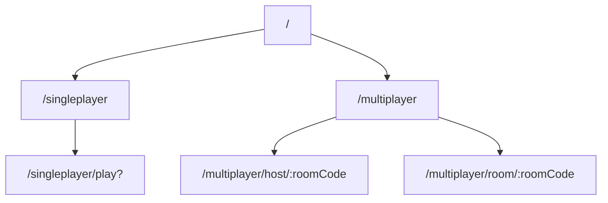

## 6. Singleplayer architecture

Singleplayer never touches the server. Everything happens in the browser against pure shared logic.

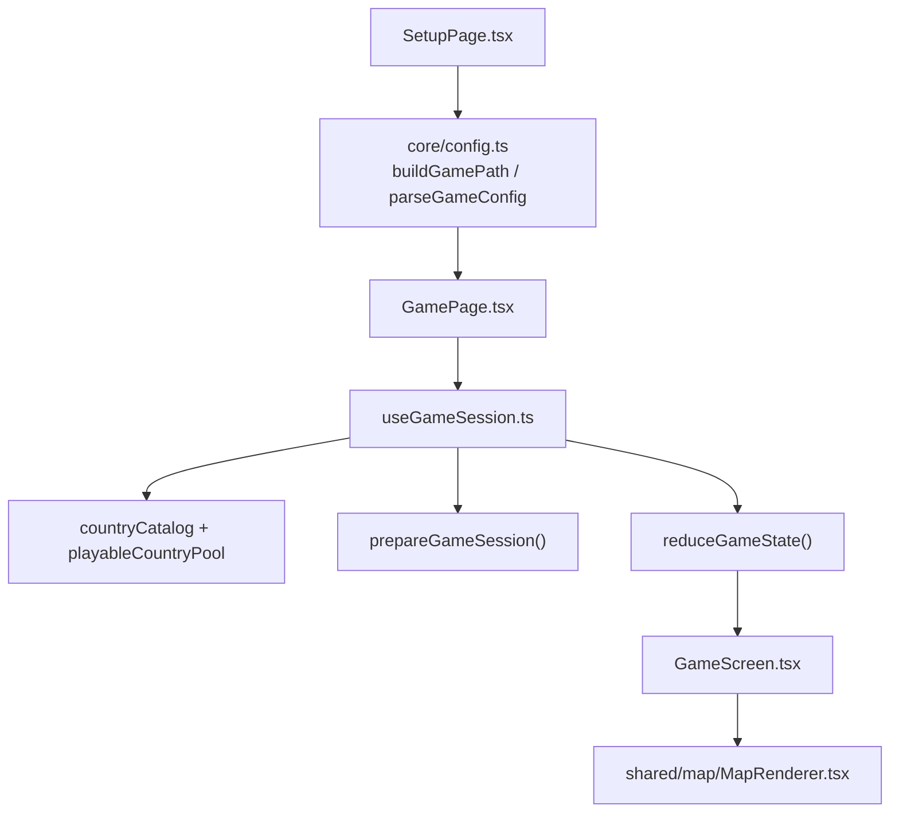

### Singleplayer state machine

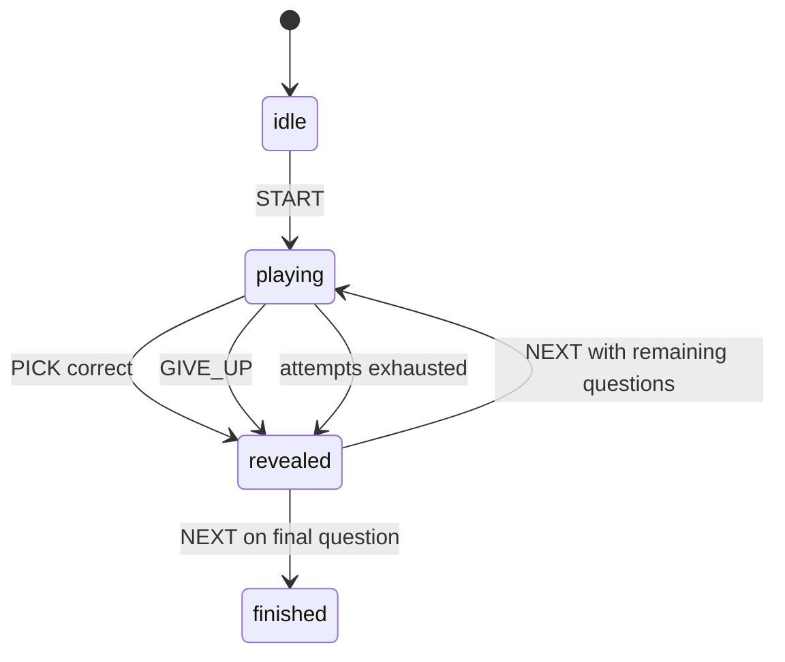

### Singleplayer file responsibilities

- `core/config.ts`: serializes game config into URL params and validates them back.
- `core/useGameSession.ts`: loads local country data, prepares a session, and dispatches reducer actions.
- `packages/game-domain/src/singleplayer/*`: the actual rules engine.
- `shared/map/MapRenderer.tsx`: reusable interactive map surface.

## 7. Multiplayer architecture

Multiplayer is split into four layers:

1. browser pages and session hooks
2. `socketGateway.ts` transport boundary
3. server room handlers/service/repository
4. shared domain/protocol packages

### End-to-end multiplayer sequence

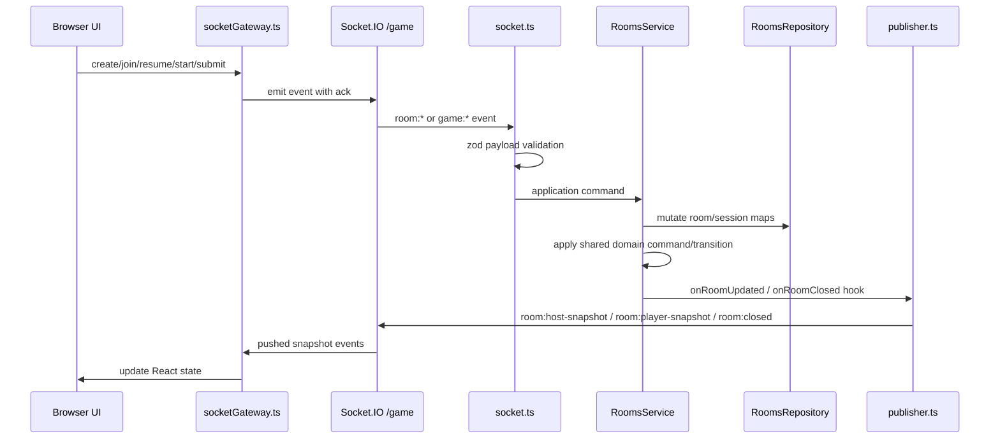

### Client multiplayer split

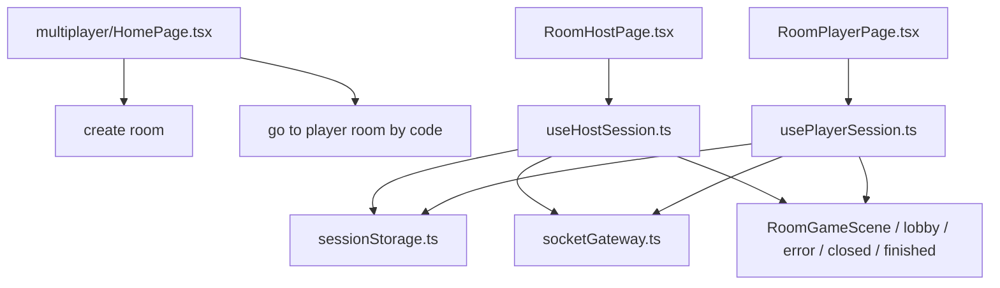

### Important multiplayer behavior

- host and player sessions are persisted in browser `localStorage`
- reconnect/resume uses `playerSessionToken`, not `socket.id`
- server state is in memory only; a server restart invalidates live room state
- host and player receive different projections of the same room state via `visibility.ts`

## 8. Server room subsystem

The server is small, but the room feature is the core of the multiplayer backend.

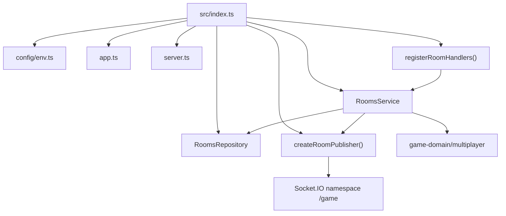

### Room handler responsibilities

- `socket.ts`
  - validates request payloads with zod
  - checks auth/session presence for protected events
  - delegates business logic to `RoomsService`
  - maps service results to ack responses

- `service.ts`
  - creates/joins/resumes rooms
  - starts games and accepts answers
  - resolves `playerSessionToken` to actual session/room context
  - schedules reveal and leaderboard transitions with `setTimeout`
  - emits hooks when room state changes

- `repository.ts`
  - stores rooms by ID and code
  - stores player sessions by token
  - stores socket-to-session mapping
  - keeps scheduled transition handles

- `publisher.ts`
  - builds role-specific snapshots
  - emits host snapshots to hosts only
  - emits player snapshots to players only
  - emits room-closed events

## 9. Multiplayer room lifecycle

The authoritative room state machine lives in `packages/game-domain/src/multiplayer`.

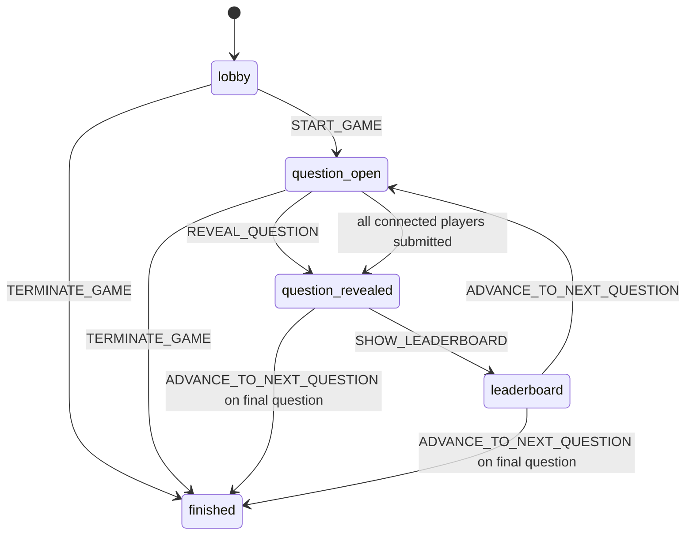

### Domain layers inside multiplayer

- `session.ts`: picks eligible countries and random question IDs.
- `factory.ts`: creates the initial lobby state.
- `commands.ts`: join, reconnect, disconnect, start game, submit answer, terminate.
- `transitions.ts`: reveal question, show leaderboard, advance question.
- `round.ts`: creates and archives round state.
- `visibility.ts`: converts internal `RoomState` into `RoomHostView` or `RoomPlayerView`.
- `selectors.ts`: shared read-only helpers such as leaderboard/current question counts.

## 10. Protocol boundary

`@maptap/game-protocol` is the typed contract between browser and server.

### Client -> server events

- `room:create`
- `room:lookup`
- `room:join`
- `room:host-resume`
- `room:player-resume`
- `game:start`
- `game:submit-answer`

### Server -> client push events

- `room:host-snapshot`
- `room:player-snapshot`
- `room:closed`

### Ack shape

Every request-response socket event uses:

```ts
type Ack<T> =
  | { ok: true; data: T }
  | { ok: false; error: GameProtocolError }
```

That means the transport contract is:

- payload schema validation at the edge
- typed success payloads
- typed protocol/domain errors instead of exceptions crossing the wire

## 11. View projection model

One internal room state becomes different outward views depending on the recipient.

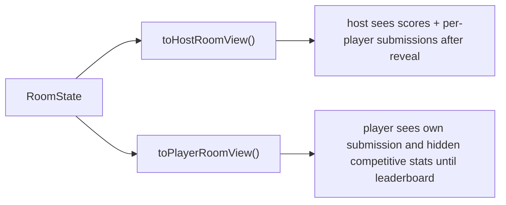

This separation is important: the server does not send raw internal room state to browsers.

## 12. Data and asset pipeline

`@maptap/country-build` is an offline preparation step. It is not part of normal web/server runtime, but it explains where the local country catalog and map tiles come from.

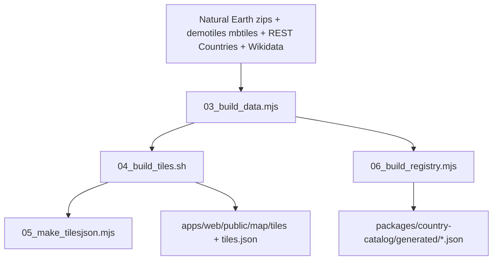

### Build outputs

- `countries.registry.json`: full generated registry
- `countries.playable.json`: filtered playable subset used at runtime
- `apps/web/public/map/tiles/**`: static vector tile export for the web map
- `apps/web/public/map/tiles/tiles.json`: TileJSON metadata

## 13. Persistence model

There are only two persistence layers in the active application:

- browser `localStorage`
  - stores `playerSessionToken` per room code and role
  - enables room resume and reconnect UX

- server memory
  - rooms, players, sessions, socket associations, and scheduled timers all live in `RoomsRepository`
  - there is no database, queue, cache server, or durable event log

Implications:

- server restarts clear all active rooms
- reconnect works only while the in-memory room/session still exists
- horizontal scaling would require a shared backing store and cross-instance event strategy

## 14. Suggested reading order for a new contributor

If you want the fastest path to understanding, read files in this order:

1. `package.json`
2. `apps/web/src/app/App.tsx`
3. `apps/server/src/index.ts`
4. `packages/game-domain/src/multiplayer/index.ts`
5. `packages/game-domain/src/multiplayer/types.ts`
6. `packages/game-domain/src/multiplayer/commands.ts`
7. `packages/game-domain/src/multiplayer/transitions.ts`
8. `packages/game-domain/src/multiplayer/visibility.ts`
9. `packages/game-protocol/src/events.ts`
10. `packages/game-protocol/src/requests.ts`
11. `packages/game-protocol/src/responses.ts`
12. `apps/server/src/features/rooms/socket.ts`
13. `apps/server/src/features/rooms/service.ts`
14. `apps/server/src/features/rooms/repository.ts`
15. `apps/web/src/multiplayer-game/core/socketGateway.ts`
16. `apps/web/src/multiplayer-game/core/useHostSession.ts`
17. `apps/web/src/multiplayer-game/core/usePlayerSession.ts`
18. `apps/web/src/singleplayer-game/core/useGameSession.ts`
19. `packages/country-catalog/src/index.ts`
20. `packages/country-build/scripts/03_build_data.mjs`

## 15. Quick mental model

If you only remember five things about this repo, remember these:

1. `game-domain` is the truth for game rules.
2. `game-protocol` is the truth for browser/server communication.
3. `country-catalog` is the truth for local country metadata used at runtime.
4. singleplayer is local-only; multiplayer adds the server room subsystem.
5. multiplayer persistence is in memory on the server and in `localStorage` on the client.
