# MapTap Project Architecture Guide

This guide is a current project map for contributors. It explains what MapTap is, how the workspaces fit together, how game state moves through the browser and server, and which files are worth reading first.

## 1. Project and game description

MapTap is an interactive educational geography game. Its learning goal is to turn political-map knowledge into active practice: a player sees a country prompt, finds the location on a map, receives immediate feedback, and repeats short rounds until the country, flag, capital, currency, and region become easier to remember.

The project was built for browser-based classroom and self-study use. It does not require installation for players, and it supports three learning formats:

- **Singleplayer world-map training**: a local browser game where the player chooses question count, difficulty, and region, then clicks countries on an interactive map.
- **Realtime multiplayer rooms**: a host creates a room, shares a short code or link, players join from their own devices, everyone answers the same timed question, and the room shows scoring plus leaderboards.
- **Local Uzbekistan quiz content**: a quiz-style multiplayer mode about Uzbekistan and Tashkent, including cities, regions, landmarks, rivers, history, and culture.

The educational idea is that mistakes become useful feedback rather than dead ends. When an answer is revealed, MapTap shows the correct place and related facts, making each round a small geography lesson rather than only a score check.

## 2. Repository summary

MapTap is an npm-workspaces monorepo with:

- a React + Vite web app in `apps/web`
- an Express + Socket.IO realtime server in `apps/server`
- pure TypeScript game-domain packages in `packages/game-domain`
- a shared Socket.IO protocol package in `packages/game-protocol`
- a generated local country catalog in `packages/country-catalog`
- an offline country-data and map-tile build pipeline in `packages/country-build`
- a placeholder/generated map asset package in `packages/map-assets`

At runtime, the web app and server both consume the shared domain, protocol, and country catalog packages. The data build package is offline tooling only.

## 3. Workspace dependency diagram

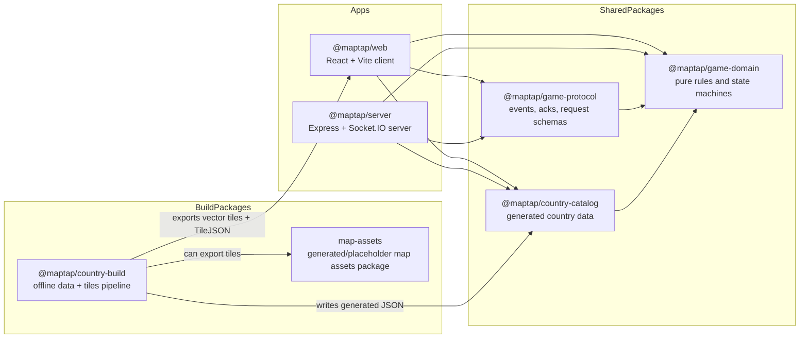
```mermaid
graph LR
    subgraph Apps
        WEB["@maptap/web<br/>React + Vite client"]
        SERVER["@maptap/server<br/>Express + Socket.IO server"]
    end

    subgraph SharedPackages
        DOMAIN["@maptap/game-domain<br/>pure rules and state machines"]
        PROTOCOL["@maptap/game-protocol<br/>events, acks, request schemas"]
        CATALOG["@maptap/country-catalog<br/>generated country data"]
    end

    subgraph BuildPackages
        BUILD["@maptap/country-build<br/>offline data + tiles pipeline"]
        ASSETS["map-assets<br/>generated/placeholder map assets package"]
    end

    WEB --> DOMAIN
    WEB --> PROTOCOL
    WEB --> CATALOG

    SERVER --> DOMAIN
    SERVER --> PROTOCOL
    SERVER --> CATALOG

    PROTOCOL --> DOMAIN
    CATALOG --> DOMAIN

    BUILD -->|writes generated JSON| CATALOG
    BUILD -->|exports vector tiles + TileJSON| WEB
    BUILD -->|can export tiles| ASSETS
```

## 4. Runtime architecture

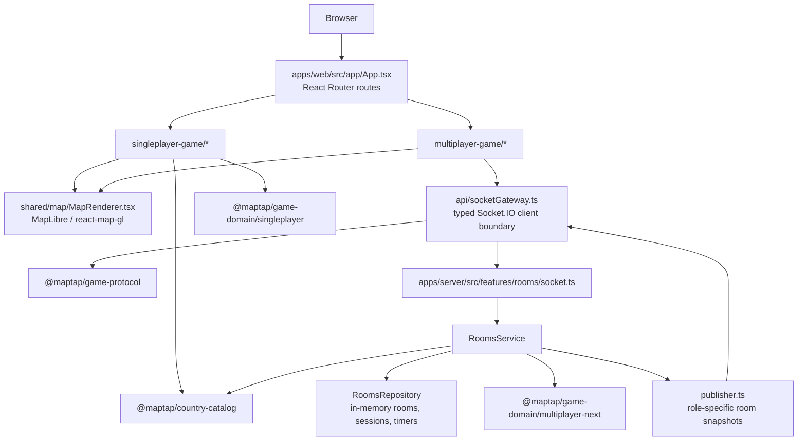
```mermaid
graph TD
    Browser["Browser"]
    Routes["apps/web/src/app/App.tsx<br/>React Router routes"]
    Single["singleplayer-game/*"]
    Multi["multiplayer-game/*"]
    Map["shared/map/MapRenderer.tsx<br/>MapLibre / react-map-gl"]

    Gateway["api/socketGateway.ts<br/>typed Socket.IO client boundary"]
    Protocol["@maptap/game-protocol"]
    SocketHandlers["apps/server/src/features/rooms/socket.ts"]
    Service["RoomsService"]
    Repo["RoomsRepository<br/>in-memory rooms, sessions, timers"]
    Publisher["publisher.ts<br/>role-specific room snapshots"]
    NextDomain["@maptap/game-domain/multiplayer-next"]
    SingleDomain["@maptap/game-domain/singleplayer"]
    Catalog["@maptap/country-catalog"]

    Browser --> Routes
    Routes --> Single
    Routes --> Multi
    Single --> SingleDomain
    Single --> Catalog
    Single --> Map
    Multi --> Gateway
    Multi --> Map
    Gateway --> Protocol
    Gateway --> SocketHandlers
    SocketHandlers --> Service
    Service --> Repo
    Service --> NextDomain
    Service --> Catalog
    Service --> Publisher
    Publisher --> Gateway
```

## 5. Web route map

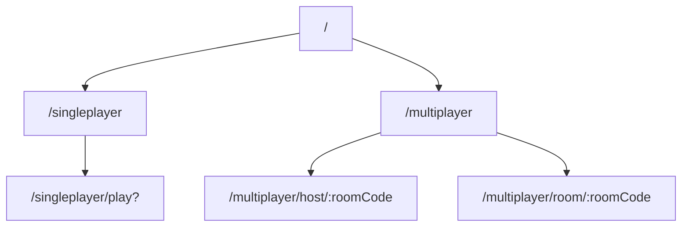
```mermaid
graph TD
    ROOT["/"] --> SINGLE_SETUP["/singleplayer"]
    ROOT --> MULTI_HOME["/multiplayer"]

    SINGLE_SETUP --> SINGLE_PLAY["/singleplayer/play?<config>"]

    MULTI_HOME --> HOST["/multiplayer/host/:roomCode"]
    MULTI_HOME --> PLAYER["/multiplayer/room/:roomCode"]
```

The top-level router lives in `apps/web/src/app/App.tsx`. Routes are intentionally shallow: the game mode owns its internal loading, lobby, active-game, error, and finished screens.

## 6. Current source tree map

This map lists the important application and package paths. It excludes `node_modules` and the large checked-in vector tile/font tree under `apps/web/public/map/**`.

```text
maptap/
|-- apps/
|   |-- server/
|   |   |-- package.json
|   |   `-- src/
|   |       |-- index.ts                # server composition root and shutdown
|   |       |-- app.ts                  # Express app and /health route
|   |       |-- server.ts               # HTTP + Socket.IO /game namespace
|   |       |-- config/
|   |       |   `-- env.ts              # zod env parsing
|   |       `-- features/
|   |           `-- rooms/
|   |               |-- ids.ts          # room/member/session/game id generation
|   |               |-- publisher.ts    # emits host/player snapshots and close events
|   |               |-- repository.ts   # in-memory room/session/timer storage
|   |               |-- service.ts      # multiplayer application service
|   |               |-- socket.ts       # Socket.IO handlers and validation
|   |               `-- types.ts        # typed Socket.IO namespace/socket data
|   `-- web/
|       |-- package.json
|       |-- vite.config.ts
|       |-- public/
|       |   |-- _headers
|       |   |-- _redirects
|       |   `-- map/                    # style.json, vector tiles, glyph PBFs
|       `-- src/
|           |-- app/
|           |   |-- main.tsx            # React root + BrowserRouter
|           |   |-- App.tsx             # route map
|           |   |-- HomePage.tsx        # mode chooser
|           |   `-- globals.css
|           |-- shared/
|           |   |-- map/                # MapRenderer and MapLibre styles
|           |   |-- ui/                 # buttons, panels, form controls
|           |   |-- utils/              # small utilities such as cn()
|           |   `-- widgets/            # reusable game display widgets
|           |-- singleplayer-game/
|           |   |-- core/               # URL config and local game hook
|           |   |-- screens/            # setup, game, invalid config
|           |   |-- components/         # header, hearts, timer, result modal
|           |   `-- index.ts
|           `-- multiplayer-game/
|               |-- api/                # socketGateway and gateway error mapping
|               |-- create/             # create-room form
|               |-- join/               # join-room form and player entry
|               |-- lobby/              # room lobby and game config panel
|               |-- game/
|               |   |-- ActiveGameScreen.tsx
|               |   |-- country-map/    # map-click multiplayer game UI
|               |   |-- quiz/           # multiple-choice quiz UI
|               |   `-- hooks/          # countdown and timestamp helpers
|               |-- finished/           # final leaderboard/results screen
|               |-- model/              # selectors and persisted config helpers
|               |-- pages/              # home, host room, player room
|               |-- screens/            # loading, error, closed
|               |-- session/            # room runtime, controllers, localStorage
|               `-- index.ts
|-- packages/
|   |-- game-domain/
|   |   `-- src/
|   |       |-- shared/                 # base types, result, random, time, errors
|   |       |-- catalog/                # country eligibility selectors
|   |       |-- singleplayer/           # local singleplayer state machine
|   |       |-- multiplayer/            # legacy multiplayer domain
|   |       `-- multiplayer-next/       # active room/game domain used by server
|   |           |-- orchestration.ts     # room + active-game command glue
|   |           |-- room/                # room membership and visibility
|   |           `-- game/                # game session, scoring, transitions, quiz content
|   |-- game-protocol/
|   |   `-- src/
|   |       |-- ack.ts
|   |       |-- errors.ts
|   |       |-- events.ts               # Socket.IO event contract
|   |       |-- requests.ts             # zod request schemas
|   |       |-- responses.ts            # response and push-event types
|   |       `-- index.ts
|   |-- country-catalog/
|   |   |-- generated/
|   |   |   |-- countries.registry.json
|   |   |   `-- countries.playable.json
|   |   `-- src/
|   |       |-- index.ts                # in-memory catalog + country pool
|   |       `-- types.ts
|   |-- country-build/
|   |   |-- data/                      # curated playable states and overrides
|   |   |-- upstream/                  # source zips and mbtiles
|   |   |-- tools/                     # bundled tippecanoe/tile-join tools
|   |   `-- scripts/                   # numbered offline build pipeline
|   `-- map-assets/                    # placeholder/generated asset package
|-- docs/
|   `-- project-architecture.md
|-- package.json
|-- tsconfig.base.json
`-- tsconfig.json
```

## 7. Singleplayer architecture

Singleplayer is fully local in the browser. It does not connect to the server.

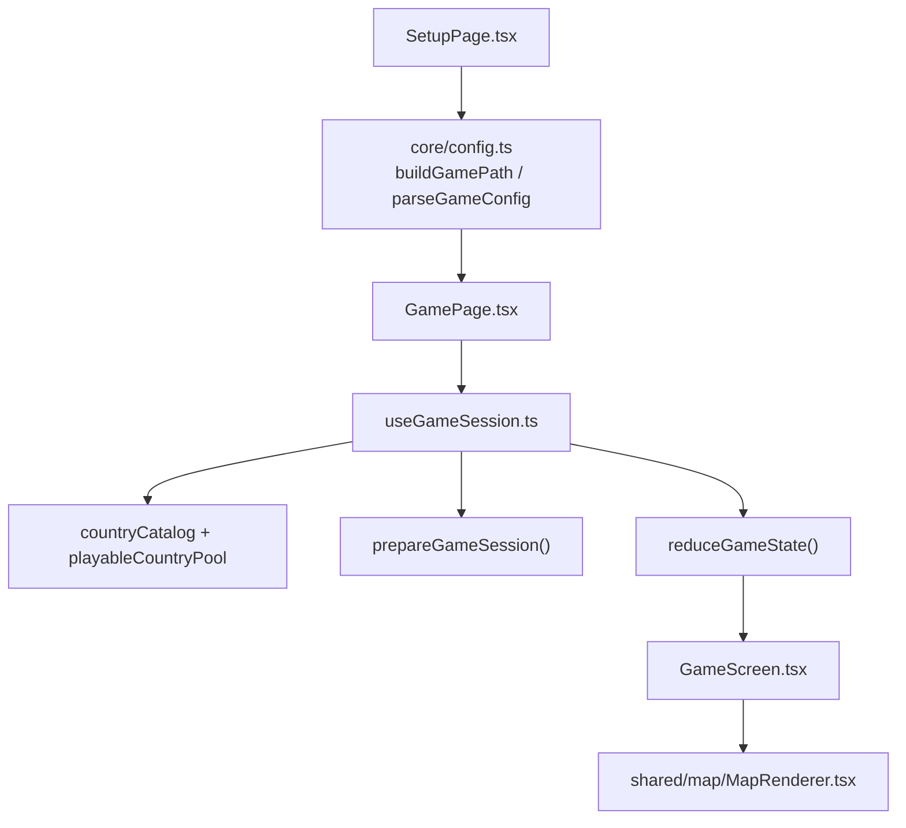
```mermaid
graph TD
    Setup["SetupPage.tsx"] --> Config["core/config.ts<br/>buildGamePath / parseGameConfig"]
    Config --> GamePage["GamePage.tsx"]
    GamePage --> Hook["useGameSession.ts"]
    Hook --> Catalog["countryCatalog + playableCountryPool"]
    Hook --> Prepare["prepareGameSession()"]
    Hook --> Reducer["reduceGameState()"]
    Reducer --> Screen["GameScreen.tsx"]
    Screen --> Map["shared/map/MapRenderer.tsx"]
```

The singleplayer state machine lives in `packages/game-domain/src/singleplayer`.

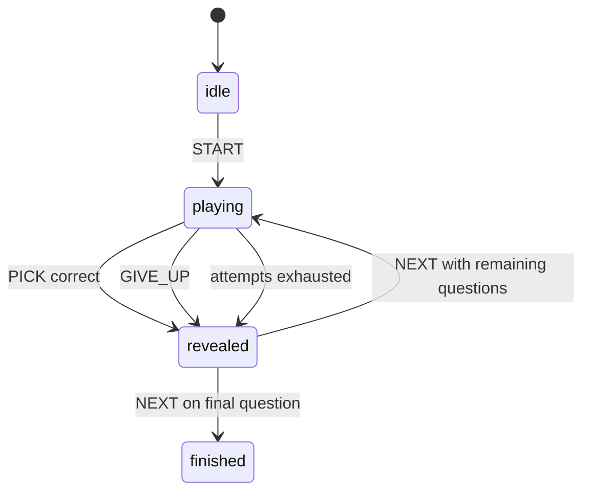
```mermaid
stateDiagram-v2
    [*] --> idle
    idle --> playing: START
    playing --> revealed: PICK correct
    playing --> revealed: GIVE_UP
    playing --> revealed: attempts exhausted
    revealed --> playing: NEXT with remaining questions
    revealed --> finished: NEXT on final question
```

Key responsibilities:

- `singleplayer-game/core/config.ts`: serializes and validates URL config.
- `singleplayer-game/core/useGameSession.ts`: loads local catalog data, prepares the session, and dispatches domain actions.
- `game-domain/src/singleplayer/session.ts`: chooses eligible country questions from the country pool.
- `game-domain/src/singleplayer/engine.ts`: applies `START`, `PICK`, `GIVE_UP`, and `NEXT`.
- `game-domain/src/singleplayer/score.ts`: scores a correct answer from response time and wrong attempts.
- `shared/map/MapRenderer.tsx`: shared map surface used by local and multiplayer map gameplay.

## 8. Multiplayer architecture

The active multiplayer implementation uses `packages/game-domain/src/multiplayer-next`. The older `packages/game-domain/src/multiplayer` tree still exists, but the server imports the `multiplayer-next` room/game model.

Multiplayer is split into four layers:

1. Browser pages, room controllers, and game screens.
2. `socketGateway.ts`, the typed transport boundary.
3. Server socket handlers, `RoomsService`, `RoomsRepository`, and publisher.
4. Shared domain/protocol packages.

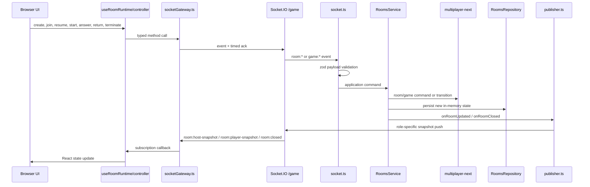
```mermaid
sequenceDiagram
    participant UI as Browser UI
    participant Runtime as useRoomRuntime/controller
    participant Gateway as socketGateway.ts
    participant Socket as Socket.IO /game
    participant Handlers as socket.ts
    participant Service as RoomsService
    participant Domain as multiplayer-next
    participant Repo as RoomsRepository
    participant Publisher as publisher.ts

    UI->>Runtime: create, join, resume, start, answer, return, terminate
    Runtime->>Gateway: typed method call
    Gateway->>Socket: event + timed ack
    Socket->>Handlers: room:* or game:* event
    Handlers->>Handlers: zod payload validation
    Handlers->>Service: application command
    Service->>Domain: room/game command or transition
    Service->>Repo: persist new in-memory state
    Service->>Publisher: onRoomUpdated / onRoomClosed
    Publisher->>Socket: role-specific snapshot push
    Socket->>Gateway: room:host-snapshot / room:player-snapshot / room:closed
    Gateway->>Runtime: subscription callback
    Runtime->>UI: React state update
```

### Client multiplayer split

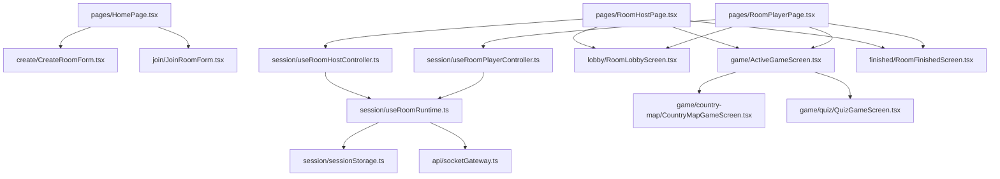
```mermaid
graph TD
    Home["pages/HomePage.tsx"] --> Create["create/CreateRoomForm.tsx"]
    Home --> Join["join/JoinRoomForm.tsx"]

    HostPage["pages/RoomHostPage.tsx"] --> HostController["session/useRoomHostController.ts"]
    PlayerPage["pages/RoomPlayerPage.tsx"] --> PlayerController["session/useRoomPlayerController.ts"]

    HostController --> Runtime["session/useRoomRuntime.ts"]
    PlayerController --> Runtime
    Runtime --> Store["session/sessionStorage.ts"]
    Runtime --> Gateway["api/socketGateway.ts"]

    HostPage --> Lobby["lobby/RoomLobbyScreen.tsx"]
    PlayerPage --> Lobby
    HostPage --> Active["game/ActiveGameScreen.tsx"]
    PlayerPage --> Active
    Active --> MapGame["game/country-map/CountryMapGameScreen.tsx"]
    Active --> Quiz["game/quiz/QuizGameScreen.tsx"]
    HostPage --> Finished["finished/RoomFinishedScreen.tsx"]
    PlayerPage --> Finished
```

Important client behavior:

- Host and player room sessions are persisted in `localStorage`.
- The saved session contains the room code, member ID, role, and `memberSessionToken`.
- Reconnect/resume uses `memberSessionToken`, not `socket.id`.
- `useRoomRuntime` centralizes connection status: connecting, ready, reconnecting, closed, and error.
- The host can start a game, return a finished room to the lobby, or terminate the room.
- Players can join from a code or link and can resume when a valid saved session exists.

### Server room subsystem

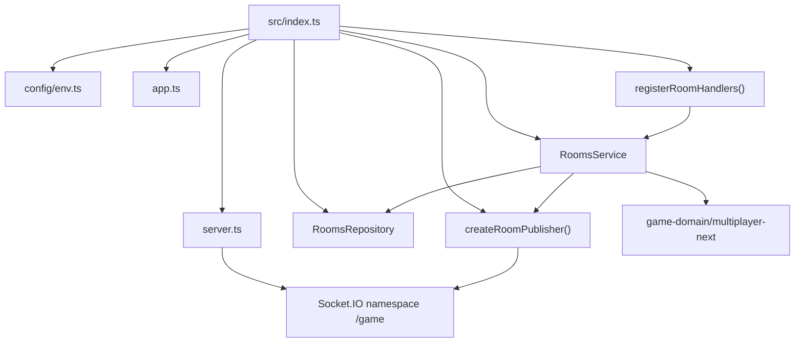
```mermaid
graph TD
    Index["src/index.ts"] --> Env["config/env.ts"]
    Index --> App["app.ts"]
    Index --> Realtime["server.ts"]
    Index --> Repo["RoomsRepository"]
    Index --> Service["RoomsService"]
    Index --> Publisher["createRoomPublisher()"]
    Index --> Handlers["registerRoomHandlers()"]

    Realtime --> Namespace["Socket.IO namespace /game"]
    Handlers --> Service
    Service --> Repo
    Service --> Domain["game-domain/multiplayer-next"]
    Service --> Publisher
    Publisher --> Namespace
```

Server responsibilities:

- `socket.ts`: validates payloads with zod, checks socket authentication, delegates to `RoomsService`, and returns typed ack responses.
- `service.ts`: creates, joins, resumes, starts games, submits answers, returns finished rooms to lobby, closes rooms, handles disconnects, and schedules timed transitions.
- `repository.ts`: stores rooms by ID/code, member sessions by token, socket-session bindings, and scheduled transition handles.
- `publisher.ts`: converts internal room state into host/player views and emits only the appropriate snapshot type.
- `server.ts`: creates the Socket.IO `/game` namespace with typed event maps and connection state recovery.

## 9. Room and game state model

`multiplayer-next` separates room state from active game state.

Room phases:

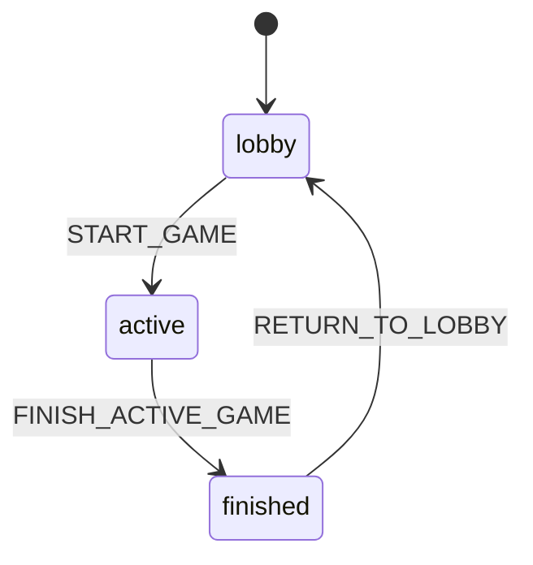
```mermaid
stateDiagram-v2
    [*] --> lobby
    lobby --> active: START_GAME
    active --> finished: FINISH_ACTIVE_GAME
    finished --> lobby: RETURN_TO_LOBBY
```

Game phases inside an active room:

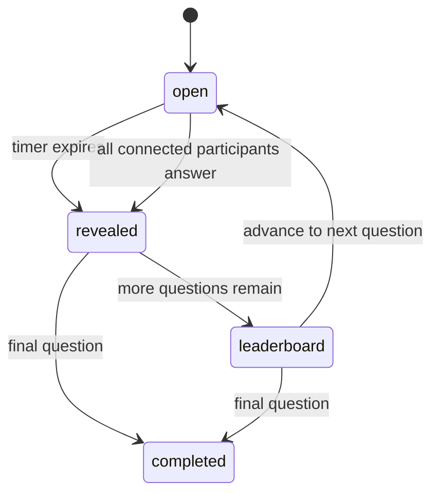
```mermaid
stateDiagram-v2
    [*] --> open
    open --> revealed: timer expires
    open --> revealed: all connected participants answer
    revealed --> leaderboard: more questions remain
    revealed --> completed: final question
    leaderboard --> open: advance to next question
    leaderboard --> completed: final question
```

The room stores membership, host identity, connection state, and game history. The active game stores the chosen game kind, generated questions, participant scores, round deadlines, submissions, reveal state, and final leaderboard.

The active game supports two question kinds:

- `map_pick_country`: player answers with a country ID chosen from the interactive map.
- `quiz_choice`: player answers with a choice ID from a multiple-choice quiz pack.

Quiz packs currently include:

- `uzbekistan-geography`
- `tashkent-city`

## 10. Protocol boundary

`@maptap/game-protocol` is the typed contract between browser and server. Runtime payload validation is done with zod request schemas in `requests.ts`, while event names and typed callbacks live in `events.ts`.

Client to server events:

- `room:create`
- `room:lookup`
- `room:join`
- `room:host-resume`
- `room:player-resume`
- `room:return-to-lobby`
- `room:terminate`
- `game:start`
- `game:submit-answer`

Server to client push events:

- `room:host-snapshot`
- `room:player-snapshot`
- `room:closed`

Every request-response socket event uses this ack shape:

```ts
type Ack<T> =
	| { ok: true; data: T }
	| { ok: false; error: GameProtocolError }
```

The transport contract is:

- validate request payloads at the server edge
- return typed success payloads
- return typed protocol/domain errors instead of throwing exceptions across the wire
- push room updates as role-specific snapshots rather than raw internal state

## 11. View projection model

The server never sends raw `RoomState` to browsers. It projects one internal room into a view for a specific member.

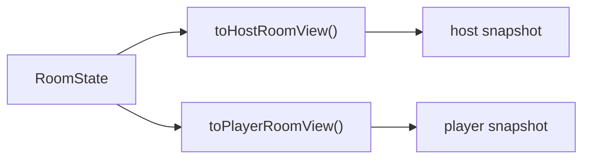
```mermaid
graph LR
    State["RoomState"] --> HostView["toHostRoomView()"]
    State --> PlayerView["toPlayerRoomView()"]

    HostView --> HostClient["host snapshot"]
    PlayerView --> PlayerClient["player snapshot"]
```

Host views can include all evaluated submissions after reveal or leaderboard. Player views focus on the viewer's own submission and only show leaderboard data once the game phase allows it.

## 12. Data and asset pipeline

`@maptap/country-build` is an offline preparation package. It is not part of normal web/server runtime, but it explains where the local country catalog and map files come from.

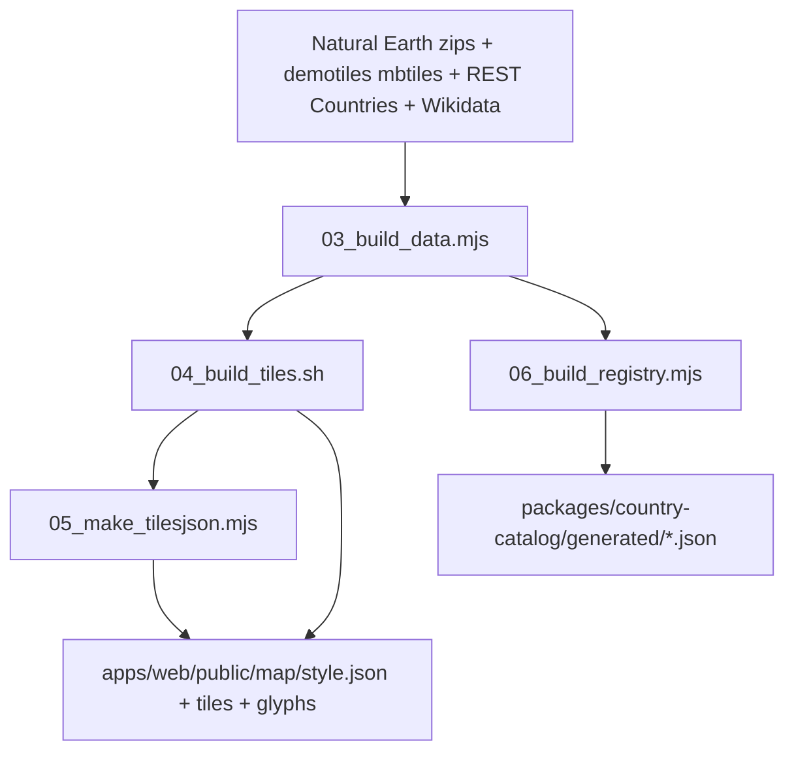
```mermaid
graph TD
    Upstream["Natural Earth zips + demotiles mbtiles + REST Countries + Wikidata"]
    BuildData["03_build_data.mjs"]
    BuildTiles["04_build_tiles.sh"]
    TileJson["05_make_tilesjson.mjs"]
    BuildRegistry["06_build_registry.mjs"]
    CatalogJson["packages/country-catalog/generated/*.json"]
    WebMap["apps/web/public/map/style.json + tiles + glyphs"]

    Upstream --> BuildData
    BuildData --> BuildTiles
    BuildData --> BuildRegistry
    BuildTiles --> TileJson
    BuildTiles --> WebMap
    TileJson --> WebMap
    BuildRegistry --> CatalogJson
```

Runtime build outputs:

- `countries.registry.json`: full generated country registry.
- `countries.playable.json`: filtered playable subset used by the app.
- `apps/web/public/map/style.json`: MapLibre style for the bundled map.
- `apps/web/public/map/tiles/**`: static vector tile export.
- `apps/web/public/map/tiles/tiles.json`: TileJSON metadata.
- `apps/web/public/map/fonts/**`: glyph PBFs used by MapLibre labels.

## 13. Persistence model

MapTap currently has no database.

Browser persistence:

- `session/sessionStorage.ts` saves host/player room sessions in `localStorage`.
- `model/gameConfig.ts` saves the host's last multiplayer game config by room code.
- Singleplayer config is represented in the `/singleplayer/play` URL query string.

Server persistence:

- `RoomsRepository` stores rooms, member sessions, socket bindings, and scheduled timers in memory.
- A server restart invalidates live rooms and member sessions.
- On shutdown, the service emits `room:closed` with `server_shutdown` before closing Socket.IO.

## 14. Environment and local commands

Root scripts:

```bash
npm run dev:web
npm run dev:server
npm run build:web
npm run build:server
npm run build:data
npm run build:country-registry
npm run build:map-assets
npm run lint
```

Server environment variables:

- `PORT`, default `3001`
- `HOST`, default `0.0.0.0`
- `CORS_ORIGIN`, default `http://localhost:5173`, comma-separated
- `REVEAL_DURATION_MS`, default `3000`
- `LEADERBOARD_DURATION_MS`, default `3000`

Web environment:

- `VITE_GAME_SERVER_ORIGIN` optionally points the client to a separate game server origin. If omitted, the Socket.IO client connects to the same origin at `/game`.

## 15. Suggested reading order

For a new contributor:

1. `apps/web/src/app/App.tsx` for the route shape.
2. `apps/web/src/app/HomePage.tsx` for the mode entry point.
3. `apps/web/src/singleplayer-game/core/useGameSession.ts` and `packages/game-domain/src/singleplayer/engine.ts` for the local game loop.
4. `apps/web/src/multiplayer-game/pages/RoomHostPage.tsx` and `apps/web/src/multiplayer-game/pages/RoomPlayerPage.tsx` for room screen orchestration.
5. `apps/web/src/multiplayer-game/session/useRoomRuntime.ts` for reconnect/resume behavior.
6. `apps/web/src/multiplayer-game/api/socketGateway.ts` plus `packages/game-protocol/src/events.ts` for the client/server boundary.
7. `apps/server/src/features/rooms/service.ts` for backend room behavior.
8. `packages/game-domain/src/multiplayer-next/orchestration.ts`, `room/*`, and `game/*` for the active multiplayer rules.
9. `packages/country-catalog/src/index.ts` and `packages/country-build/scripts/*` when working on country data or map assets.

## 16. Architectural constraints to keep in mind

- Keep game rules in `packages/game-domain`, not React components or Socket.IO handlers.
- Keep network payload shape in `packages/game-protocol`, not duplicated by hand in client/server files.
- Send projected room/game views to clients; do not expose raw room state.
- Treat `memberSessionToken` as the reconnect identity for multiplayer sessions.
- Keep the server repository in-memory unless a deliberate persistence layer is added.
- Keep the country catalog generated and deterministic; manual fixes belong in the build data/overrides path.
- Prefer reusing `shared/map`, `shared/ui`, and `shared/widgets` before adding new UI primitives.
